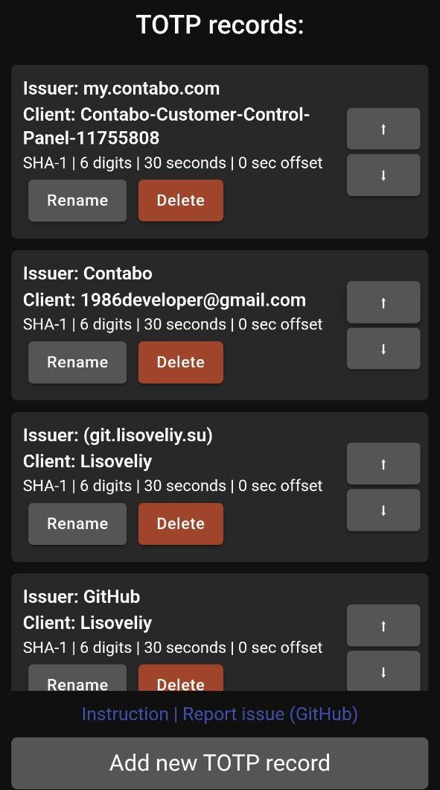

# TOTPFIT

### Another 2FAuthenticator based on TOTP for Zepp OS with Google Authenticator and Proton Authenticator support

### Features:

- Support of `otpauth://` links with parameters "client", "issuer", "algorithm", "digits", "period", "offset"
- Support of Google Authenticator migration links formated: `otpauth-migration://offline?data=...`
- Support of **Proton Authenticator** export with parameters "client", "issuer", "algorithm", "digits", "period", "offset" **(BETA)**
- Addition/Sort/Edition/Deletion of TOTPs from mobile app

### Guides:

[How to add 2FA TOTP records (keys) on app](/docs/guides/how-to-add-totps/README.md)

#### This repo has mirror for public issues on [GitHub](https://github.com/Lisoveliy/totpfit)

#### To contribute on this repo you must use my [Gitea](https://git.lisoveliy.su/Lisoveliy/totpfit)

Don't be shy to contact me for access!