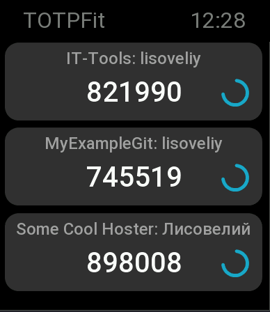

# TOTPFIT 
### Another 2FAuthenticator based on TOTP for Zepp Amazfit GTS 4 with Google Authenticator migration Support



### Features:
- Supports of ```otpauth://``` links with parameters "client", "issuer", "algorithm", "digits", "period", "offset"
- Addition/Edition/Deletion of TOTPs from mobile app
- Support of Google Authenticator migration links formated: ```otpauth-migration://offline?data=...``` (At this stage with only 6 digits and only 30 seconds period)

### Guides:

[How to add 2FA TOTP records (keys) on app](/docs/guides/how-to-add-totps/README.md)

#### This repo has mirror for issues on [GitHub](https://github.com/Lisoveliy/totpfit)