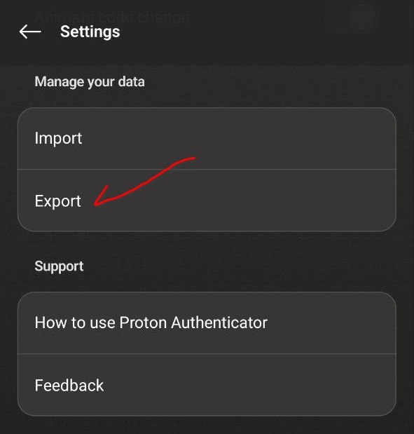
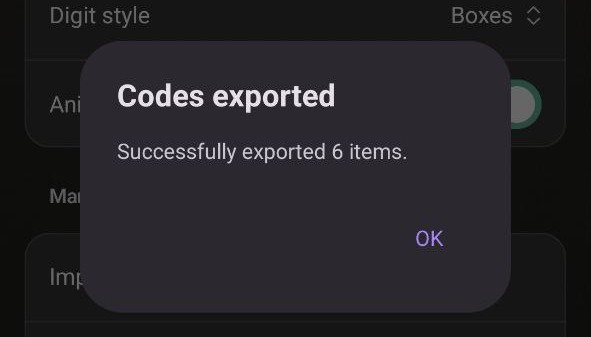
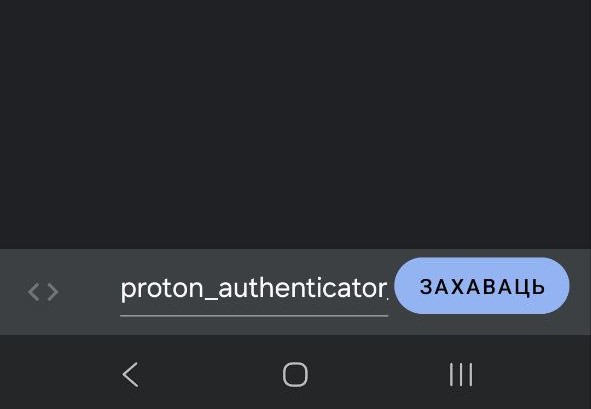
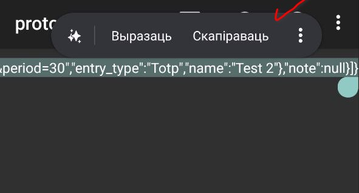

# How to add 2FA TOTP records (keys) on app

### If you use default 2FA otpauth:// links

To add 2FA TOTP records using 2FA TOTP QR-Codes, you must scan QR-Code of service providing 2FA and scan (decode) it to a URI. If you have screenshot of QR-Code -- scan it on any app providing scan from image, ex: Search screen on Google Assistant. For example, this QR-Code will represent next URI string:

Copy this URI string and paste it to app using button _"Add new TOTP record"_:

Then press OK, record will appear on page

### If you use google migrations (otpauth-migration:// links)

To add 2FA TOTP records using migration from Google Authenticator app, you must go to menu, select "Transfer accounts" -> "Export accounts"

Select codes then screenshot QR code and scan (decode) it to a URI. Use any app providing scan from image, ex: "Search screen" function (Google Lens) on Google Assistant.

For example, this QR-Code will represent next URI string:

After scaning copy this URI string and paste it to app using button _"Add new TOTP record"_:

Then press OK, all selected records from Google Authenticator will appear on page

### If you use Proton Authenticator

To add 2FA TOTP records from Proton Authenticator you must go to settings and press "Export":

After this save file and open it on text editor:

Copy all stuff from file at clipboard and import in application:

Then press OK, records will appear on page:

